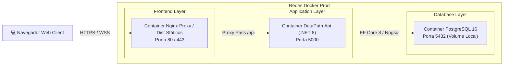
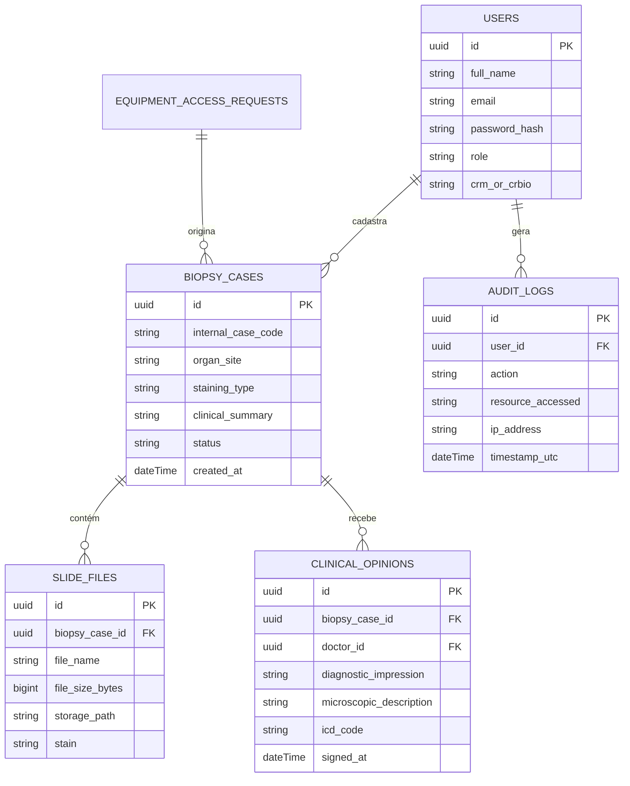
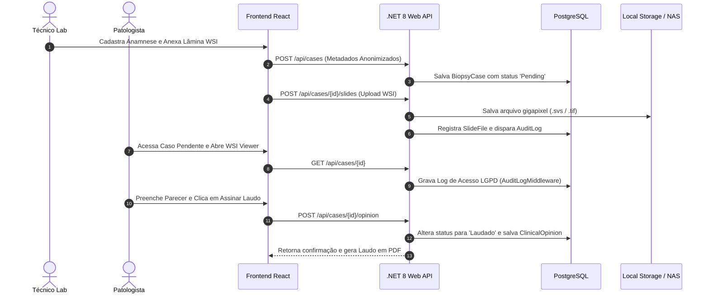

# 🏛️ Diagramas de Arquitetura & Fluxo de Dados — dataPATH

Visualização gráfica das camadas, componentes, bancos de dados e fluxos operacionais da plataforma **dataPATH**.

---

## 1. Diagrama de Contexto do Sistema (C4 Level 1)

O mapa de contexto a seguir ilustra a interação entre os diferentes atores (Técnicos, Médicos Patologistas, Pesquisadores) e o ecossistema de infraestrutura do dataPATH:

```mermaid
graph TD
    subgraph Usuários do Sistema
        A["🔬 Técnico de Laboratório"]
        B["👨‍⚕️ Patologista Consultor"]
        C["🎓 Pesquisador / Parceiro"]
        D["⚙️ Administrador de TI"]
    end

    subgraph Plataforma dataPATH (Hetzner Cloud)
        E["🌐 Frontend React (Nginx Proxy / SSL)"]
        F["⚡ Backend C# .NET 8 Web API"]
        G["🗄️ Banco PostgreSQL 16"]
        H["💾 Armazenamento Local / NAS QNAP"]
    end

    subgraph Serviços Externos
        I["🔒 Portainer Server (Hetzner PAC)"]
        J["🛡️ Let's Encrypt (ACME SSL)"]
    end

    A -->|"Upload de WSI & Anamnese"| E
    B -->|"Análise WSI & Emissão de Laudos"| E
    C -->|"Solicitação de Onboarding"| E
    D -->|"Governança & Auditoria"| E

    E -->|"Requisições REST / Bearer JWT"| F
    F -->|"Persistência de Dados & Logs"| G
    F -->|"Armazenamento de Arquivos WSI"| H
    I -->|"Automação de Deploy & Exec API"| E
    J -->|"Renovação Automática de Certificado SSL"| E
```

---

## 2. Arquitetura de Containers (C4 Level 2)

Visão interna dos containers Docker orquestrados via `docker-compose.prod.yml`:



---

## 3. Diagrama de Entidade e Relacionamento (ERD - Banco de Dados)

Modelo relacional simplificado do PostgreSQL:



---

## 4. Fluxo Sequencial de Entrada de Casos e 2ª Opinião Remota


