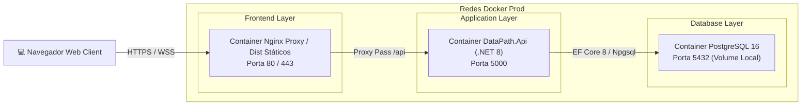

# 🏛️ Diagramas de Arquitetura em Padrão Astah UML — dataPATH

Visualização gráfica das camadas, componentes, bancos de dados e fluxos operacionais da plataforma **dataPATH**, diagramados segundo o padrão visual de modelagem **Astah UML / Enterprise Architect**.

---

## 1. Diagrama de Contexto do Sistema (Astah UML Context Diagram)

O mapa de contexto ilustra a interação entre os atores (Técnicos, Médicos Patologistas, Pesquisadores) e o ecossistema de infraestrutura do dataPATH:


### Código Mermaid Correspondente:
```mermaid
graph TD
    subgraph Usuários do Sistema
        A["🔬 Técnico de Laboratório"]
        B["👨‍⚕️ Patologista Consultor"]
        C["🎓 Pesquisador / Parceiro"]
        D["⚙️ Administrador de TI"]
    end

    subgraph Plataforma dataPATH (Hetzner Cloud)
        E["🌐 Frontend React (Nginx Proxy / SSL)"]
        F["⚡ Backend C# .NET 8 Web API"]
        G["🗄️ Banco PostgreSQL 16"]
        H["💾 Armazenamento Local / NAS QNAP"]
    end

    A -->|"Upload de WSI & Anamnese"| E
    B -->|"Análise WSI & Emissão de Laudos"| E
    C -->|"Solicitação de Onboarding"| E
    D -->|"Governança & Auditoria"| E

    E -->|"Requisições REST / Bearer JWT"| F
    F -->|"Persistência de Dados & Logs"| G
    F -->|"Armazenamento de Arquivos WSI"| H
```

---

## 2. Diagrama de Entidade e Relacionamento (Astah ERD - Banco de Dados)

Modelo relacional do banco de dados PostgreSQL 16 no padrão Astah ERD:


---

## 3. Diagrama de Sequência de Ingestão WSI & Laudo (Astah Sequence Diagram)

Fluxo cronológico de interações entre os atores e containers do sistema:


---

## 4. Arquitetura de Containers (C4 Level 2)

Visão interna dos containers Docker orquestrados via `docker-compose.prod.yml`:


